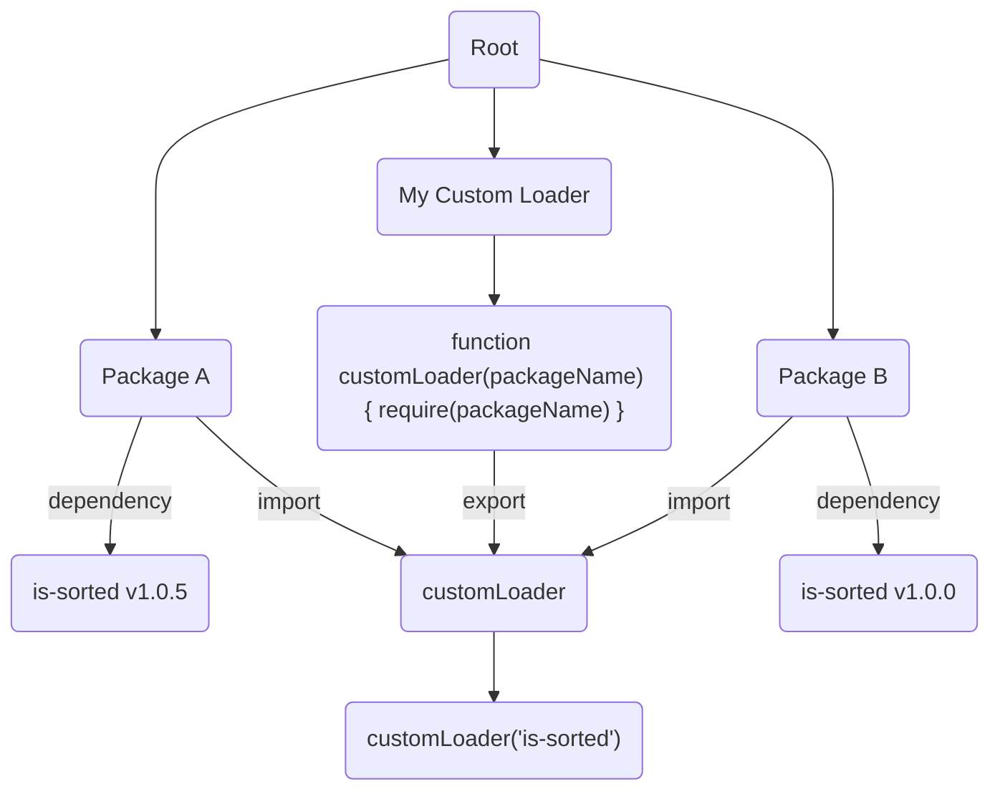

## Node Workspaces Bug

This repo tries to illustrate what I consider a bug on NPM Workspaces. 

See [#43429](https://github.com/nodejs/node/issues/43429) at [nodejs/node](https://github.com/nodejs/node).

This happened on a repository that had 3 packages but only one was really 
important. The package had some webpack bundler which was repeated across
the rest of the projects so all of those libraries were hoisted to the
root.

The package was using `require` through a loader for a public dependency
but local to that repository. npm placed that dependency **within** said 
package.

To recap, loader on the root, loaded library on the package.

Once Webpack tried to run, it couldn't find the dependency.

Logging the `cwd` plus `require.resolve` made me realise that even though the 
`cwd` was correct, it wasn't affecting the `require.resolve` chain.

IMHO, respecting `process.cwd` in a workspaces scenario should be good and 
wouldn't be bad as it's just another step on the `resolve` chain. However,
I don't know enough so this could be a wrong assumption. 

### How is this architectured



This is a _simple_ workspace which has 3 packages. 

* `my-custom-loader`: This is basically a loader to replicate the bug I found 
which just takes a string and a parameter, does a `require` of that string and
pass those parameters to the required package.
* `package-a` and `package-b` are identical and they log the same information.
To be able to illustrate the bug they require `is-sorted` with strict different
versions. This will ensure that they both are in different folders. They also
behave differently, so we can illustrate the point.

### Running the reproducible case

Clone this repository, run this from the root:

```bash
npm install
npm t
```

What you should see is that both calls of the functions match within the
package. However, `package-b` does not match and produces this output:

```
Calling is-sorted with [ 1, 1, 3, 4, 5 ]
Function name is checksort
Result is true

Calling is-sorted with [ 1, 1, 3, 4, 5 ]
Function name is checksort
Result is false
```

This happens because the first call is using version `1.0.5` and the 
second one (from the loader) is using `1.0.0` which does not have this fix.

Check that `require.paths` are also different yet the `process.cwd()` is the
same across modules.
